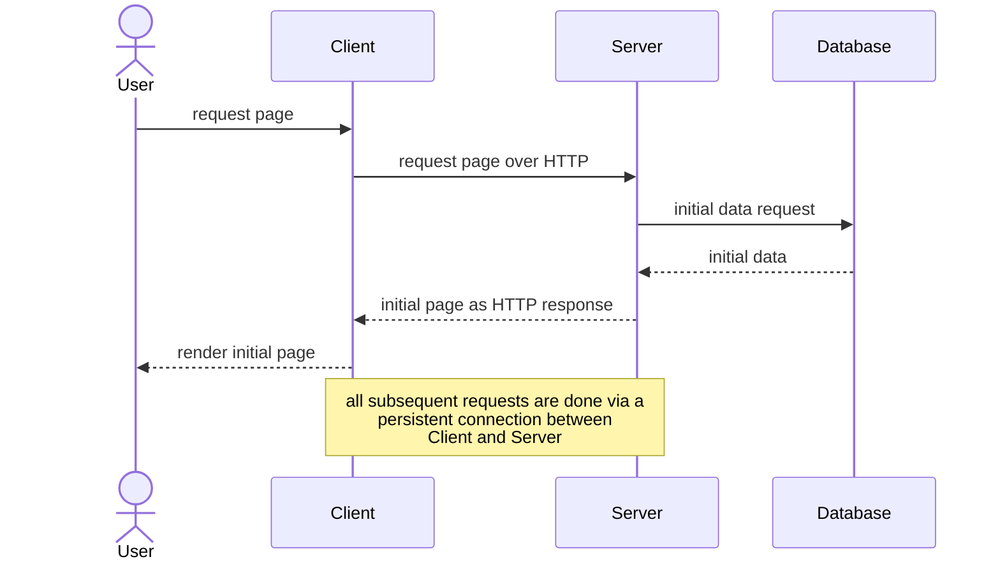
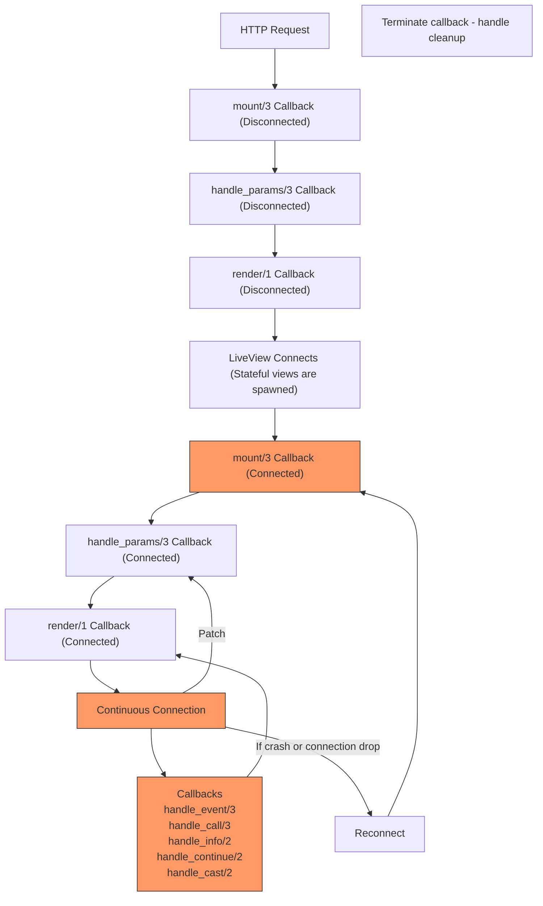

---
layout:
  title:
    visible: true
  description:
    visible: false
  tableOfContents:
    visible: true
  outline:
    visible: true
  pagination:
    visible: true
---

# 🐔 Adding dynamic behavior

You may notice that viewing the to-do list may be nice, but it is sorely lacking the key features of a to-do application like creating a new to-do and marking a to-do as done.

If you have dug around with the original Phoenix documentation, you will notice that there is no mention on how this can be achieved. This is because in the base version of Phoenix, handling button actions and performing such dynamic changes requires the use of JavaScript. This is not uncommon for most server-side frameworks.

> "But I don't want to use JavaScript!"\
> \- Presumably you

This is where **Phoenix LiveView** comes in. Phoenix LiveView is an "add-on" on top of base Phoenix that provides real-time server-rendered HTML.


The following content covered will require a bit of time to grasp as it is a relatively new concept introduced over this guide. Do take your time when reading and understanding.


## LiveView

Phoenix LiveView inverts the traditional request-response lifecycle that we have seen so far. Instead of sending a request to the API/server and re-rendering the front-end based on the response, LiveView first uses a regular HTTP request-response to retrieve the initial page.&#x20;

The key benefit from doing this is reducing the amount of time spent waiting for HTTP responses in a traditionally stateless application.

However, once the page is rendered, a persistent connection (via a socket) is established between client and server and this connection is used to communicate any changes/actions performed from the front-end to the back-end and vice versa.

This gives rise to the following lifecycle for LiveView (courtesy of [John Elm Labs](https://johnelmlabs.com/posts/liveview-lifecycle-flow-chart) for this diagram):

It may seem like a handful but we will only be focusing on the components colored orange as they are the most fundamental ideas of LiveView.&#x20;
