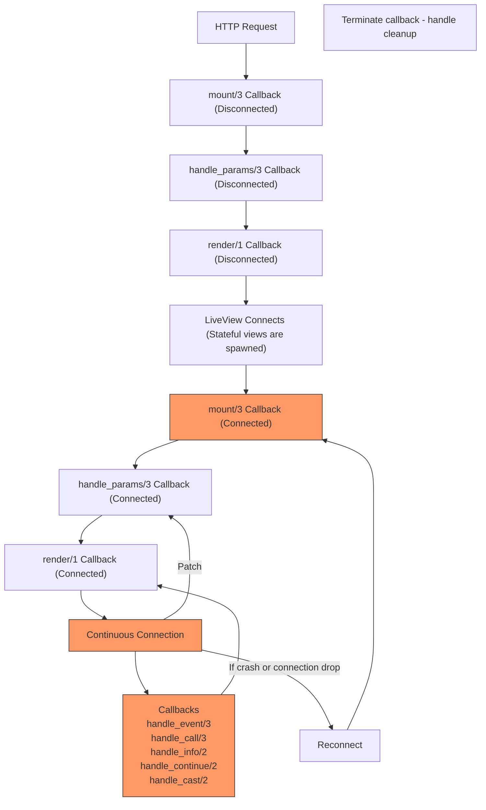

---
layout:
  title:
    visible: true
  description:
    visible: false
  tableOfContents:
    visible: true
  outline:
    visible: true
  pagination:
    visible: true
---

# 🐔 Adding dynamic behavior

You may notice that viewing the to-do list may be nice, but it is sorely lacking the key features of a to-do application like creating a new to-do and marking a to-do as done.

If you have dug around with the original Phoenix documentation, you will notice that there is no mention on how this can be achieved. This is because in the base version of Phoenix, handling button actions and performing such dynamic changes requires the use of JavaScript. This is not uncommon for most server-side frameworks.

> "But I don't want to use JavaScript!"\
> \- Presumably you

This is where **Phoenix LiveView** comes in. Phoenix LiveView is an "add-on" on top of base Phoenix that provides real-time server-rendered HTML.


The following content covered will require a bit of time to grasp as it is a relatively new concept introduced over this guide. Do take your time when reading and understanding.


## Introducing LiveView

Phoenix LiveView inverts the traditional request-response lifecycle that we have seen so far. Instead of sending a request to the API/server and re-rendering the front-end based on the response, LiveView first uses a regular HTTP request-response to retrieve the initial page.&#x20;

The key benefit from doing this is reducing the amount of time spent waiting for HTTP responses in a traditionally stateless application.

However, once the page is rendered, a persistent connection (via a socket) is established between client and server and this connection is used to communicate any changes/actions performed from the front-end to the back-end and vice versa.


This gives rise to the following lifecycle for LiveView (courtesy of [John Elm Labs](https://johnelmlabs.com/posts/liveview-lifecycle-flow-chart) for this diagram):



It may seem like a handful but we will only be focusing on the components colored orange as they are the most fundamental ideas of LiveView.&#x20;

## Getting started with LiveView


If you wish to get the converted version of the LiveView application immediately without running through all of the steps to convert the current demo application to LiveView, you can pull the branch `liveview-base` from the GitHub repository and get started.\
\
The full demo application is found on the `liveview` branch.\
\
Otherwise, you can expand the section below to learn how to convert a base Phoenix project to use LiveView.


<details>

<summary>Base Phoenix to Phoenix LiveView</summary>

A great point of reference is this [guide](https://smartlogic.io/blog/converting-phoenix-views-to-liveviews/) following steps 1 to 5. However, to explicitly state the steps needed:

* Replace `get "/todo", PageController, :todo` with `live "/todo", TodoLive`

<!---->

* Add a new module `PracticalElixirDemoWeb.TodoLive` under `practical_elixir_demo_web/live/todo_live.ex` with the following:


```elixir
defmodule PracticalElixirDemoWeb.TodoLive do
  use PracticalElixirDemoWeb, :live_view
end
```


* Create a new file: `lib/practical_elixir_demo_web/live/todo_live.html.heex` (note that the base name must be the same as the module file name)


```html
<div class="w-[40%] mx-auto my-8">
  <h1 class="font-bold text-3xl my-8 py-4 px-4 bg-slate-100">Todo List</h1>
  <input type="text" placeholder="New task" class="rounded-md w-full mb-8" />
  <%= for item <- @todo_list do %>
    <.todo_item item={item} />
  <% end %>
</div>
```


* Populate `TodoLive` with the `mount/3` function and copy over the `todo_item/1` function from the old view


```elixir
defmodule PracticalElixirDemoWeb.TodoLive do
  alias PracticalElixirDemo.Todo
  use PracticalElixirDemoWeb, :live_view

  def mount(_params, _session, socket) do
    socket = assign(socket, todo_list: Todo.get_items())
    {:ok, socket, layout: false}
  end

  def todo_item(assigns) do
    ~H"""
    <div class="flex gap-x-4 mb-4 last:mb-0 items-center">
      <%= if @item.is_done? do %>
        <p>✅</p>
      <% else %>
        <p>❌</p>
      <% end %>
      <div class="w-full">
        <div class="flex justify-between items-center w-full">
          <p>
            <%= @item.title %>
          </p>

          <div>
            <%= if @item.is_done? do %>
              <button class="bg-blue-300 px-3 py-1 font-bold rounded-md text-sm">Mark as Done</button>
            <% else %>
              <button class="bg-green-300 px-3 py-1 font-bold rounded-md text-sm">
                Mark as Not Done
              </button>
            <% end %>
            <button class="bg-yellow-300 px-3 py-1 font-bold rounded-md text-sm">Edit</button>
            <button class="bg-red-300 px-3 py-1 font-bold rounded-md text-sm">Delete</button>
          </div>
        </div>
        <p class="italic">
          <%= @item.description %>
        </p>
      </div>
    </div>
    """
  end
end
```


* Re-run your application and go to [http://localhost:4000](http://localhost:4000), you should still see the same application

</details>

Whether you have pulled the branch `liveview-base` or followed the guide in the expandable above, you will notice that there are several changes to the structure of the project:

1. Adding `lib/practical_elixir_demo_web/live/` with `todo_live.ex` and `todo_live.html.heex`: these are just to create a logical separation between LiveView and base Phoenix, though most projects will adopt a similar separation
2. Converting `get "/todo"...` with `live "/todo"`: this is a key part of declaring the `/todo` route as being a LiveView; we can omit the specific controller action as the entire LiveView will be treated as the controller + view
3. Declaring the data retrieval in `mount/3` of `todo_live.ex`: as per the new lifecycle of LiveView, the `mount/3` function is called before the page is rendered so we will use it to load the initial data (i.e. to-do list)

Everything else is the same as the previous code we had written! That's one of the biggest draws of Phoenix LiveView - a high degree of interoperability with base Phoenix!

## Creating new to-dos

