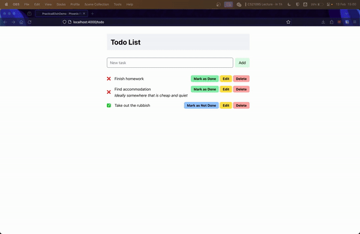

---
layout:
  title:
    visible: true
  description:
    visible: false
  tableOfContents:
    visible: true
  outline:
    visible: true
  pagination:
    visible: true
---

# 🐔 Adding dynamic behavior

You may notice that viewing the to-do list may be nice, but it is sorely lacking the key features of a to-do application like creating a new to-do and marking a to-do as done.

If you have dug around with the original Phoenix documentation, you will notice that there is no mention on how this can be achieved. This is because in the base version of Phoenix, handling button actions and performing such dynamic changes requires the use of JavaScript. This is not uncommon for most server-side frameworks.

> "But I don't want to use JavaScript!"\
> \- Presumably you

This is where **Phoenix LiveView** comes in. Phoenix LiveView is an "add-on" on top of base Phoenix that provides real-time server-rendered HTML.


The following content covered will require a bit of time to grasp as it is a relatively new concept introduced over this guide. Do take your time when reading and understanding.


## Adding buttons

Before we dive into LiveView, there are some changes to the design that we will add such as buttons for the actions and a task bar to add new to-do items.

Replace the `todo.html.heex` file with:

```html
<div class="w-[40%] mx-auto my-8">
  <h1 class="font-bold text-3xl my-8 py-4 px-4 bg-slate-100">Todo List</h1>
  <form phx-submit="add-todo" class="flex justify-between items-center mb-8">
    <input type="text" placeholder="New task" name="task-name" class="rounded-md w-full" />
    <button type="submit" class="px-4 py-2 bg-green-100 rounded-md ml-2">
      Add
    </button>
  </form>
  <%= for item <- @todo_list do %>
    <.todo_item item={item} />
  <% end %>
</div>
```

And edit the `todo_item` functional component:

```html
    <div class="flex gap-x-4 mb-4 last:mb-0 items-center">
      <%= if @item.is_done? do %>
        <p>✅</p>
      <% else %>
        <p>❌</p>
      <% end %>
      <div class="w-full">
        <div class="flex justify-between items-center w-full">
          <p>
            <%= @item.title %>
          </p>

          <div>
            <%= if @item.is_done? do %>
              <button class="bg-blue-300 px-3 py-1 font-bold rounded-md text-sm">
                Mark as Not Done
              </button>
            <% else %>
              <button class="bg-green-300 px-3 py-1 font-bold rounded-md text-sm">
                Mark as Done
              </button>
            <% end %>
            <button class="bg-yellow-300 px-3 py-1 font-bold rounded-md text-sm">Edit</button>
            <button class="bg-red-300 px-3 py-1 font-bold rounded-md text-sm">Delete</button>
          </div>
        </div>
        <p class="italic">
          <%= @item.description %>
        </p>
      </div>
    </div>
```

You should see the following UI once done:

<figure><figcaption></figcaption></figure>

## Introducing LiveView

Phoenix LiveView inverts the traditional request-response lifecycle that we have seen so far. Instead of sending a request to the API/server and re-rendering the front-end based on the response, LiveView first uses a regular HTTP request-response to retrieve the initial page.&#x20;

The key benefit from doing this is reducing the amount of time spent waiting for HTTP responses in a traditionally stateless application.

However, once the page is rendered, a persistent connection (via a socket) is established between client and server and this connection is used to communicate any changes/actions performed from the front-end to the back-end and vice versa.


This gives rise to the following lifecycle for LiveView (courtesy of [John Elm Labs](https://johnelmlabs.com/posts/liveview-lifecycle-flow-chart) for this diagram):


It may seem like a handful but we will only be focusing on the components colored orange as they are the most fundamental ideas of LiveView.&#x20;

## Getting started with LiveView


If you wish to get the converted version of the LiveView application immediately without running through all of the steps to convert the current demo application to LiveView, you can pull the branch `liveview-base` from the GitHub repository and get started.\
\
The full demo application is found on the `liveview` branch.\
\
Otherwise, you can expand the section below to learn how to convert a base Phoenix project to use LiveView.


<details>

<summary>Migrating base Phoenix to Phoenix LiveView</summary>

A great point of reference is this [guide](https://smartlogic.io/blog/converting-phoenix-views-to-liveviews/) following steps 1 to 5. However, to explicitly state the steps needed:

* Replace `get "/todo", PageController, :todo` with `live "/todo", TodoLive`

<!---->

* Add a new module `PracticalElixirDemoWeb.TodoLive` under `practical_elixir_demo_web/live/todo_live.ex` with the following:


```elixir
defmodule PracticalElixirDemoWeb.TodoLive do
  use PracticalElixirDemoWeb, :live_view
end
```


* Create a new file: `lib/practical_elixir_demo_web/live/todo_live.html.heex` (note that the base name must be the same as the module file name)


```html
<div class="w-[40%] mx-auto my-8">
  <h1 class="font-bold text-3xl my-8 py-4 px-4 bg-slate-100">Todo List</h1>
  <div class="flex justify-between items-center mb-8">
    <input type="text" placeholder="New task" class="rounded-md w-full" />
    <button type="button" class="px-4 py-2 bg-green-100 rounded-md ml-2">Add</button>
  </div>
  <%= for item <- @todo_list do %>
    <.todo_item item={item} />
  <% end %>
</div>
```


* Populate `TodoLive` with the `mount/3` function and copy over the `todo_item/1` function from the old view


```elixir
defmodule PracticalElixirDemoWeb.TodoLive do
  alias PracticalElixirDemo.Todo
  use PracticalElixirDemoWeb, :live_view

  def mount(_params, _session, socket) do
    socket = assign(socket, todo_list: Todo.get_items())
    {:ok, socket, layout: false}
  end

  def todo_item(assigns) do
    ~H"""
    <div class="flex gap-x-4 mb-4 last:mb-0 items-center">
      <%= if @item.is_done? do %>
        <p>✅</p>
      <% else %>
        <p>❌</p>
      <% end %>
      <div class="w-full">
        <div class="flex justify-between items-center w-full">
          <p>
            <%= @item.title %>
          </p>

          <div>
            <%= if @item.is_done? do %>
              <button class="bg-blue-300 px-3 py-1 font-bold rounded-md text-sm">Mark as Done</button>
            <% else %>
              <button class="bg-green-300 px-3 py-1 font-bold rounded-md text-sm">
                Mark as Not Done
              </button>
            <% end %>
            <button class="bg-yellow-300 px-3 py-1 font-bold rounded-md text-sm">Edit</button>
            <button class="bg-red-300 px-3 py-1 font-bold rounded-md text-sm">Delete</button>
          </div>
        </div>
        <p class="italic">
          <%= @item.description %>
        </p>
      </div>
    </div>
    """
  end
end
```


* Re-run your application and go to [http://localhost:4000](http://localhost:4000), you should still see the same application

</details>

Whether you have pulled the branch `liveview-base` or followed the guide in the expandable above, you will notice that there are several changes to the structure of the project:

1. Adding `lib/practical_elixir_demo_web/live/` with `todo_live.ex` and `todo_live.html.heex`: these are just to create a logical separation between LiveView and base Phoenix, though most projects will adopt a similar separation
2. Converting `get "/todo"...` with `live "/todo"`: this is a key part of declaring the `/todo` route as being a LiveView; we can omit the specific controller action as the entire LiveView will be treated as the controller + view
3.  Declaring the data retrieval in `mount/3` of `todo_live.ex`: as per the new lifecycle of LiveView, the `mount/3` function is called before the page is rendered so we will use it to load the initial data (i.e. to-do list)

    You may also notice that we call `assign` in the `mount/3` function while passing the socket and a keyword list of values. `assign` is used to persist the state of the page in the persistent connection (socket). It is what allows us to interact with the client without having to use HTTP calls!

Everything else is the same as the previous code we had written! That's one of the biggest draws of Phoenix LiveView - a high degree of interoperability with base Phoenix!

## Creating new to-dos

Let's make the "Add" button functional. First, notice that we have defined a `form` element in `todo_live.html.heex` and within the `form` element, we have included an attribute: `phx-submit`. This creates a [binding](https://hexdocs.pm/phoenix\_live\_view/welcome.html#bindings) between the client and server.&#x20;


```html
  <form phx-submit="add-todo" class="flex justify-between items-center mb-8">
    <input type="text" placeholder="New task" name="task-name" class="rounded-md w-full" />
    <button type="submit" class="px-4 py-2 bg-green-100 rounded-md ml-2">
      Add
    </button>
  </form>
```


What this binding does is inform Phoenix that on form submission (via the button in the form), Phoenix should trigger the given event. Then, you must specify the appropriate event handler in the LiveView controller:


```elixir
  def handle_event("add-todo", value, socket) do
    {:noreply, socket}
  end
```


As highlighted previously (in [#introducing-liveview](adding-dynamic-behavior.md#introducing-liveview "mention")), [`handle_event/3`](https://hexdocs.pm/phoenix\_live\_view/Phoenix.LiveView.html#c:handle\_event/3) is one of many callbacks that the server uses to handle when a client event is triggered. The event is comprised of three parameters:

1. Event name: name of the event raised by the client (this is the name that is given to `phx-submit`)
2. Event payload: values given to the server from the client, usually the form data
3. Existing socket: represents the persistent connection, updating the data stored in this socket informs the client to update its view to render the latest information as well

With this understanding, we can now implement the to-do item creation logic.

The first thing we want to do is to retrieve the existing list of to-dos from the socket. This can be done using [pattern-matching.md](../elixir-fundamentals/pattern-matching.md "mention") since both the the `value` and `socket` are maps.


```elixir
  def handle_event(
        "add-todo",
        %{"task-name" => task_name},
        %Phoenix.LiveView.Socket{assigns: %{todo_list: todo_list}} = socket
      ) do
    {:noreply, socket}
  end
```



In this demonstration, we have opted to keep things simple and remove the use of the to-do description field. However, if you wish to extend the application, feel free to add support for filling in that field as well!


Then, we can update the to-do list with the new task and submit the update to the client via the socket.


```elixir
  def handle_event(
        "add-todo",
        %{"task-name" => task_name},
        %Phoenix.LiveView.Socket{assigns: %{todo_list: todo_list}} = socket
      ) do
    new_todo_list = [%TodoItem{title: task_name}] ++ todo_list
    {:noreply, assign(socket, todo_list: new_todo_list)}
  end
```


We're literally just adding a new `TodoItem` to the front of the `todo_list` and re-assigning it to the socket. When you try out this interaction on your application, you will see the new task added to the very top of the to-do list.

Therein lies one of the strengths of Phoenix LiveView: the ability to use handle client-server interaction directly as Elixir functions, rather than HTTP calls.


`:noreply` tells the client that there is no additional information to be sent to the client. `:reply` exists to indicate that there is some reply to be sent to the client.\
\
For more information, refer to the documentation of [`handle_event/3`](https://hexdocs.pm/phoenix\_live\_view/Phoenix.LiveView.html#c:handle\_event/3)


## Marking to-dos as done

Another common action in a to-do application would be to mark your tasks as done. We can implement such logic like we have for the previous feature. However, this time, we will need to update several fields of the HEEx file to make this a reality.

The most important step is to identify the relative position of each to-do item within the list. This can be done by altering how we generate each to-do item, adding an `id` to each of them representing their unique position:


```html
  <%= for {item, id} <- Enum.with_index(@todo_list) do %>
    <.todo_item item={item} id={id} />
  <% end %>
```


We use a helper function `Enum.with_index/2` to include the relative index of each to-do item. Then, we pass the `id` to the `todo_item` functional component. In the controller, we need to also update the functional component to make use of this `id`:


```html
            <%= if @item.is_done? do %>
              <button
                class="bg-blue-300 px-3 py-1 font-bold rounded-md text-sm"
                type="button"
                phx-value-id={@id}
              >
                Mark as Not Done
              </button>
            <% else %>
              <button
                class="bg-green-300 px-3 py-1 font-bold rounded-md text-sm"
                type="button"
                phx-value-id={@id}
              >
                Mark as Done
              </button>
            <% end %>
```


We use the `phx-value-*` binding to specify this as a parameter. This means that when we perform an event on the button, this value would be sent as part of the `values` map that the `handle_event/3` callback receives.

Speaking of which, we should also add a binding to handle the button clicks as well. We use the `phx-click` binding for this:

```html
            <%= if @item.is_done? do %>
              <button
                class="bg-blue-300 px-3 py-1 font-bold rounded-md text-sm"
                type="button"
                phx-value-id={@id}
                phx-click="mark-not-done"
              >
                Mark as Not Done
              </button>
            <% else %>
              <button
                class="bg-green-300 px-3 py-1 font-bold rounded-md text-sm"
                type="button"
                phx-value-id={@id}
                phx-click="mark-done"
              >
                Mark as Done
              </button>
            <% end %>
```

We have deliberately made these two separate events but you can very well use one event to handle both cases (we will leave this up to you to figure it out!). Finally, we can implement the behavior of the buttons via these events:

```elixir
  def handle_event(
        "mark-not-done",
        %{"id" => task_id},
        %Phoenix.LiveView.Socket{assigns: %{todo_list: todo_list}} = socket
      ) do
    updated_todo_list =
      todo_list
      |> Enum.with_index()
      |> Enum.map(fn {todo, id} ->
        if String.to_integer(task_id) == id do
          Map.update(todo, :is_done?, false, fn _ -> false end)
        else
          todo
        end
      end)

    {:noreply, assign(socket, todo_list: updated_todo_list)}
  end

  def handle_event(
        "mark-done",
        %{"id" => task_id},
        %Phoenix.LiveView.Socket{assigns: %{todo_list: todo_list}} = socket
      ) do
    updated_todo_list =
      todo_list
      |> Enum.with_index()
      |> Enum.map(fn {todo, id} ->
        if String.to_integer(task_id) == id do
          Map.update(todo, :is_done?, true, fn _ -> true end)
        else
          todo
        end
      end)

    {:noreply, assign(socket, todo_list: updated_todo_list)}
  end
```

Here, we are using `Enum.with_index/1` and `Enum.map/2` to implement the update logic. Since state is immutable in Elixir, we have to re-create the to-do list with the `is_done?` field of the target to-do item changed to the appropriate value.

Now, if you ran the application, you will be able to add new to-do items and change their completion status:

<figure><figcaption></figcaption></figure>

## What's next?

:tada: Woohoo! You now have a to-do list application! Feel free to try implementing the other features like deleting and editing to-dos.


For editing, you can try making the title editable. For deletion, use a similar logic as updating the "done" status of the to-do items.


However, if you refresh the page, all of your to-dos will disappear! That's not good... This is where data persistence comes in. As mentioned in the introduction chapter, the next chapter is entirely optional but highly recommended for you to gain a holistic understanding of using Phoenix for web development (since data persistence is basically a must-have in production applications!)
