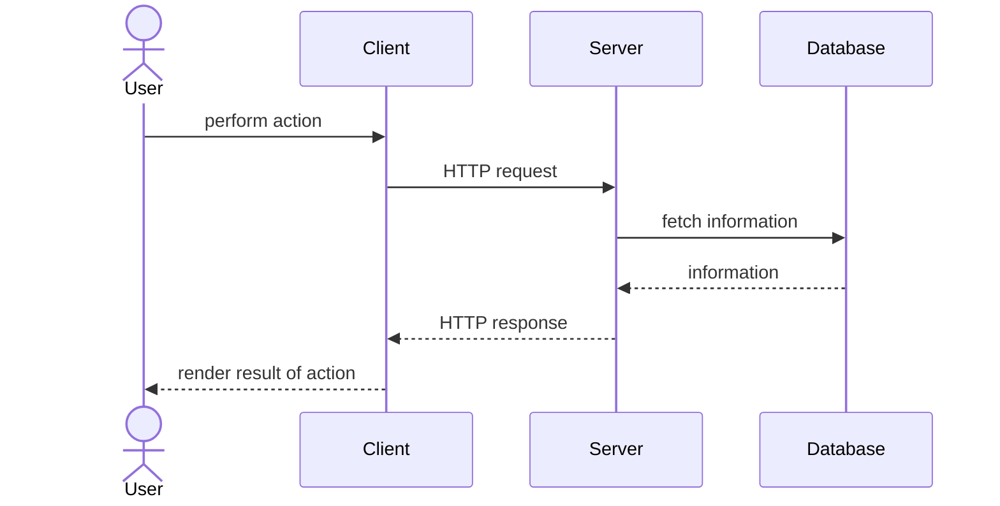

---
layout:
  title:
    visible: true
  description:
    visible: false
  tableOfContents:
    visible: true
  outline:
    visible: true
  pagination:
    visible: true
---

# 🦤 First steps

## Request lifecycle

Phoenix (not LiveView, just regular Phoenix) relies on the typical HTTP request lifecycle that many other web applications use:



## Basics of HTTP

HyperText Transfer Protocol or HTTP is an application-layer network protocol designed to transfer data between networked devices and is run on top of the TCP protocol.

If all of that seemed like a bunch of word soup, don't worry, all it means is that HTTP is the medium through which clients and servers will communicate with one another.

HTTP requests are primarily composed of the following:

1. Verb: what kind of action should be done with this request; GET, PUT, POST, DELETE
2. Path: what the endpoint of this request is
3. Body: additional contents of the request, usually stored as JSON
4. Query parameters: following a `?` at the end of the path, key-value pairs delimited by `&`

With the very fundamentals of HTTP out of the way, let us start with implementing a new page for our to-do list application.

## Representing to-do items&#x20;

The first thing we would like to do is to first define how a note would be represented in our application. Although we will be integrating SQLite3 to persist our data, let us first try representing the to-do items in a purely Elixir method: using [structures](https://hexdocs.pm/elixir/structs.html).

Structures are an extension over [#maps](../elixir-fundamentals/types/keyword-lists-and-maps.md#maps "mention") that provide additional compile-time checks and default values that maps do not provide directly.

We can define a new struct the same way we define methods and modules, using the `defstruct` macro.&#x20;

First, create a new folder under `lib/practical_elixir_demo/` and title it `todo/`. Then, add a new file called `todo_item.ex` which is where we will declare our struct:


```elixir
defmodule PracticalElixirDemo.Todo.TodoItem do
  @derive Jason.Encoder
  defstruct [:title, description: nil, is_done?: false]
end
```


For this guide, we will keep things really simple and only include three fields for our to-do items. We added a module attribute `@derive` to inform Phoenix that the `TodoItem` struct should be encoded to a JSON form. This is useful when we're sending data from the server to the client.

We can also create a few dummy to-do items to get started. We can store those under `lib/practical_elixir_demo/todo/todo.ex`:


```elixir
defmodule PracticalElixirDemo.Todo do
  alias PracticalElixirDemo.Todo.TodoItem

  def get_items do
    [
      %TodoItem{
        title: "Finish homework"
      },
      %TodoItem{
        title: "Find accommodation",
        description: "Ideally somewhere that is cheap and quiet"
      },
      %TodoItem{
        title: "Take out the rubbish",
        is_done?: true
      }
    ]
  end
end
```



`alias` is used so we can reference the `TodoItem` struct without using the full module name.


Now that we have created our to-do item struct, we can now start to think about working with these constructs, such as returning these structs as HTTP responses and rendering them on the front-end.
