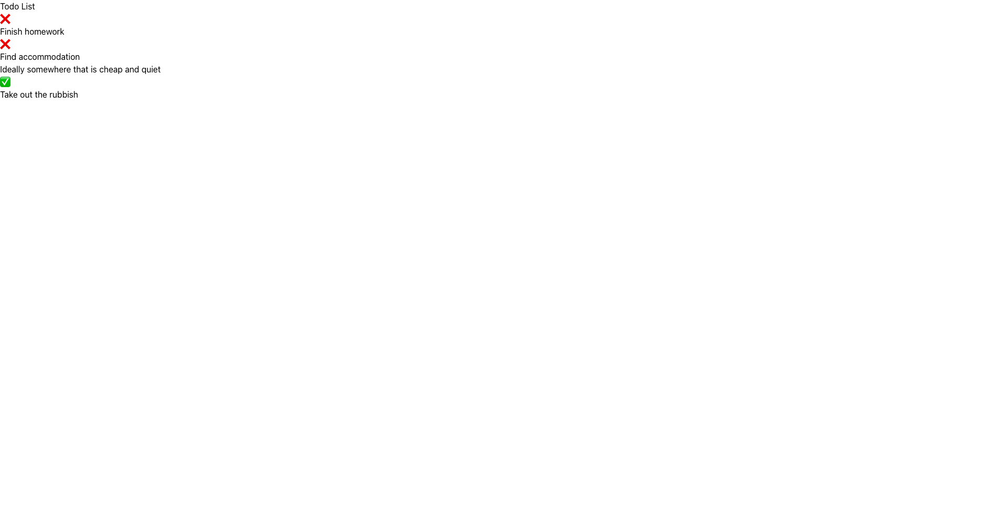

---
layout:
  title:
    visible: true
  description:
    visible: false
  tableOfContents:
    visible: true
  outline:
    visible: true
  pagination:
    visible: true
---

# 🐣 Viewing to-do list

## Creating a new route

Similar to how we have created the `GET /api/todo` endpoint, we will first create the route in `router.ex`. This time, add it to the existing `scope "/"` that was given.

```elixir
  scope "/", PracticalElixirDemoWeb do
    # ...
    get "/todo", PageController, :todo
  end
```

## Creating the associated controller action

Once done, we need to add the associated controller action `todo` in the `PageController`. We will disable the default layout as we want to style the web page ourselves.

```elixir
defmodule PracticalElixirDemoWeb.PageController do
  # ...

  def todo(conn, _params) do
    render(
      conn,
      :todo,
      layout: false,
      todo_list: PracticalElixirDemo.Todo.get_items()
    )
  end
end

```

Notice that we directly retrieve the information needed for rendering to the to-do list and pass it as a keyword to the `render/3` function. This way, we are able to use this information directly in the page.

## Introducing HEEx (HTML + EEx)

Finally, add a file to `lib/practical_elixir_demo_web/controllers/page_html/` titled `todo.html.heex`. Note that the filename must correspond to the atom specified in the `render/2` function call, i.e. `todo`.


Note that this differs from the original method proposed by the Phoenix framework (which involves using the `~H` sigil to render the HTML. This is the alternative approach given and is the method that is recommended.


Now that we have the `todo.html.heex` file, we can design the to-do list view of our application.


HEEx is a templating language designed with work with embedding Elixir in HTML. It is very similar to how Vue.js and Django handles embedding (where you can write Javascript/Python inside HTML).


Then, you can populate the file with the following:

```html
<div>
  <h1>Todo List</h1>
  <%= for item <- @todo_list do %>
    <%= if item.is_done? do %>
      <p>✅</p>
    <% else %>
      <p>❌</p>
    <% end %>
    <p>
      <%= item.title %>
    </p>
    <p>
      <%= item.description %>
    </p>
  <% end %>
</div>

```

Then, if you ran the web application and navigated to [http://localhost:4000/todo](http://localhost:4000/todo), you should notice the following being rendered:

<figure><figcaption></figcaption></figure>

Nothing too fancy, but as you can see, the dummy to-do list we have constructed earlier now appears on the page.

With this, we can introduce several other concepts in Phoenix.&#x20;

### Evaluating expressions

You may have noticed the unique `<%= %>` syntax used in the code above. What it effectively does is executes the expression within the block and inserts the results into the page. You can try it out by adding a line like `<p><%= 5 + 5 %></p>` and it will render to the front-end as `10`.

You may also use `<% %>` (without `=`) if your expression does not return any values or you do not wish to output the return value. As such, we can replace `<%= else %>` with `<% else %>` too!

### Reading values from controller

Notice that previously, we had passed a `todo_list` keyword into the `render/3` function in the `page_controller.ex` file. We have accessed this variable from the view via the `@todo_list` syntax.

This is a nifty way to access variables passed to the view via the controller.&#x20;

### Functional components

Functional components serve as a shared abstraction for commonly used UI that can be reused across views and layouts. They are not a new concept, and can often be seen in other front-end libraries like React.

For our demo, let's abstract each to-do list item to its own functional component so that any modifications made to one will be uniform across all.

To declare a new functional component for that view controller, all you need to do is to add a function with the function name as the name of the intended functional component and it must receive an argument called `assigns`. The purpose of this argument is to allow the HEEx to pass data to the functional component to be used within the functional component:

```elixir
defmodule PracticalElixirDemoWeb.PageHTML do
  # ...

  def todo_item(assigns) do
    ~H"""
    <%= if @item.is_done? do %>
      <p>✅</p>
    <% else %>
      <p>❌</p>
    <% end %>
    <p>
      <%= @item.title %>
    </p>
    <p>
      <%= @item.description %>
    </p>
    """
  end
end

```

You use the `@<variable>` notation to access values passed to the functional component via `assigns`. Also notice that we have effectively moved the entire block found in the `for` loop into the functional component.

Then, you can use the functional component in the HEEx as follows:

```html
<div>
  <h1>Todo List</h1>
  <%= for item <- @todo_list do %>
    <.todo_item item={item} />
  <% end %>
</div>
```

We have replaced the bulk of the `for` loop body with the functional component which is referenced via the `.<functional_component>` notation with the `@item` given as an a HTML attribute. Phoenix intelligently does the mapping from HEEx to functional component.
