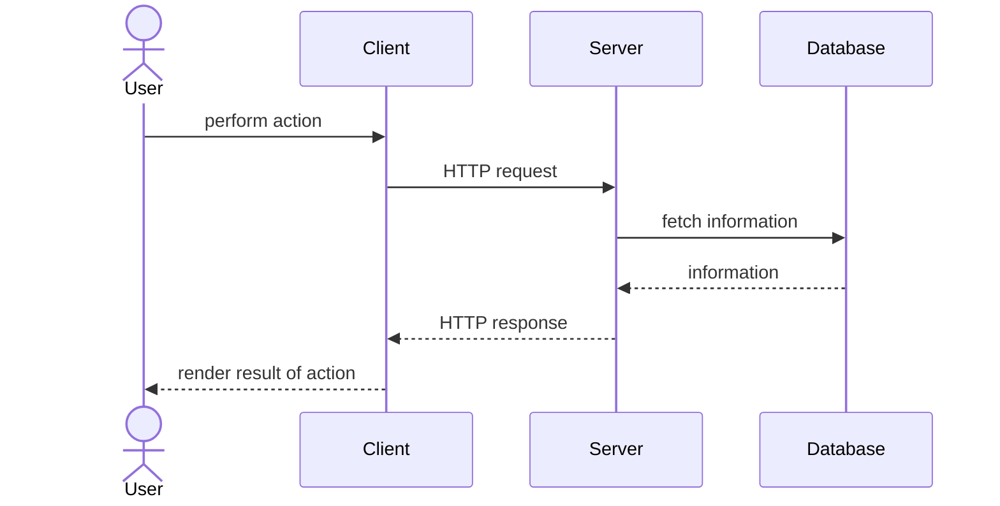

---
layout:
  title:
    visible: true
  description:
    visible: false
  tableOfContents:
    visible: true
  outline:
    visible: true
  pagination:
    visible: true
---

# 🦤 Your first page

Phoenix (not LiveView, just regular Phoenix) relies on the typical HTTP request lifecycle that many other web applications use:

